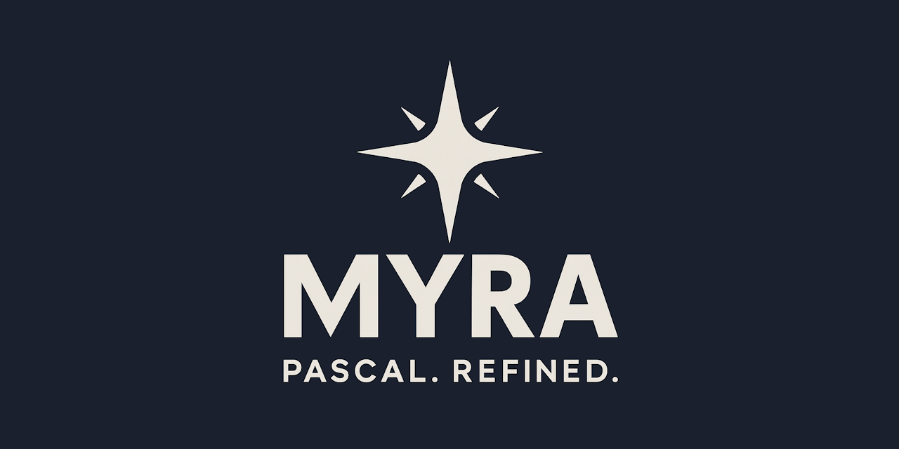

<div align="center">



[](https://discord.gg/tPWjMwK)
[](https://www.reddit.com/r/myralang/)
[](https://www.facebook.com/groups/myralang)
[](https://bsky.app/profile/tinybiggames.com)

A minimal systems programming language that compiles to native executables via C++23.

[Quick Start](#prerequisites) • [Documentation](docs/README.md) • [Examples](docs/EXAMPLES.md) • [FAQ](docs/FAQ.md)

</div>

## What is Myra?

Inspired by Niklaus Wirth's Oberon—itself derived from Pascal—Myra preserves Pascal's readability and structure while removing decades of accumulated complexity. The result: **45 keywords**, **9 built-in types**, seamless C++ interoperability, and code that compiles to native executables.

```myra
module exe HelloWorld;

import Console;

begin
  Console.PrintLn('Hello from Myra!');
end.
```

## ✨ Key Features

- ✨ **Minimal by design** — 45 keywords, 9 types. No redundancy.
- 🔗 **C++ interoperability** — Mix Myra and C++ freely. No wrappers needed.
- 📦 **Batteries included** — Zig compiler, LLDB debugger, raylib, Myra Edit, all bundled.
- 🖥️ **Myra Edit** — Full editor with syntax highlighting, IntelliSense, and debugging.
- 🐛 **Integrated debugger** — Source-level debugging with breakpoints and stepping.
- 🧬 **Type extension** — Record inheritance without class complexity.
- ⚙️ **Methods** — Bind routines to types with explicit `Self` parameter.
- 🛡️ **Exception handling** — Built-in try/except/finally.
- 📊 **Dynamic arrays** — SetLength/Len with automatic memory management.
- 🧪 **Unit testing** — Built-in TEST blocks for integrated testing.

## 🚀 Quick Start

### Prerequisites

- Windows (64-bit)

### Installation

1. Download the latest release from the [Releases](https://github.com/tinyBigGAMES/Myra/releases) page
2. Extract to a folder (e.g., `C:\myra`)
3. Add the `bin` folder to your PATH

That's it! Everything is bundled — Zig compiler, LLDB debugger, Myra Edit, raylib, and the standard library.

Verify installation:
```bash
myra version
```

### Create Your First Project

```bash
myra init HelloWorld
cd HelloWorld
```

**Option 1: Use Myra Edit (Recommended)**
```bash
myra edit
```
This opens your project in a fully-configured editor with IntelliSense, debugging, and build integration.

**Option 2: Command Line**
```bash
myra build
myra run
```

Output:
```
Hello from Myra!
```

## 📖 Language Overview

### Built-in Types

| Type | Description |
|------|-------------|
| `BOOLEAN` | True or false |
| `CHAR` | Signed single byte character |
| `UCHAR` | Unsigned single byte character |
| `INTEGER` | 64-bit signed integer |
| `UINTEGER` | 64-bit unsigned integer |
| `FLOAT` | 64-bit floating point |
| `STRING` | Auto-managed string |
| `SET` | Bit set for ordinal ranges |
| `POINTER` | Untyped pointer |

### Records and Methods

```myra
type
  TCounter = record
    Value: INTEGER;
  end;

method Increment(var Self: TCounter);
begin
  Self.Value := Self.Value + 1;
end;

method GetValue(var Self: TCounter): INTEGER;
begin
  return Self.Value;
end;

var
  Counter: TCounter;
begin
  Counter.Value := 0;
  Counter.Increment();
  Console.PrintLn('Count: {}', Counter.GetValue());
end.
```

### Type Extension

```myra
type
  TShape = record
    X: INTEGER;
    Y: INTEGER;
  end;

  TCircle = record(TShape)
    Radius: INTEGER;
  end;

var
  Circle: TCircle;
begin
  Circle.X := 100;      // inherited from TShape
  Circle.Y := 100;      // inherited from TShape
  Circle.Radius := 50;  // own field
end.
```

### C++ Integration

Myra's defining feature: seamless C++ integration. If it's not Myra syntax, it's C++.

```myra
module exe CppDemo;

import Console;

#include_header '<cmath>'

#startcpp header
inline int Square(int x) {
    return x * x;
}
#endcpp

begin
  Console.PrintLn('Square(7) = {}', Square(7));
  Console.PrintLn('sqrt(16) = {}', std::sqrt(16.0));
end.
```

### Exception Handling

```myra
try
  DoRiskyOperation();
except
  Console.PrintLn('Error: {}', System.GetExceptionMessage());
finally
  Cleanup();
end;
```

### Unit Testing

```myra
#unittestmode ON

module exe Tests;

import UnitTest;

routine Add(const A: INTEGER; const B: INTEGER): INTEGER;
begin
  return A + B;
end;

begin
end.

test 'Add returns correct sum';
begin
  TestAssertEqual(5, Add(2, 3));
end;
```

## Module Types

| Type | Description |
|------|-------------|
| `module exe Name` | Executable program |
| `module lib Name` | Static library |
| `module dll Name` | Dynamic/shared library |

## 📚 Documentation

| Document | Description |
|----------|-------------|
| [Quick Start](docs/QUICK_START.md) | Get running in 5 minutes |
| [Tutorial](docs/TUTORIAL.md) | Guided learning path |
| [Language Reference](docs/LANGUAGE_REFERENCE.md) | Complete specification |
| [Standard Library](docs/STANDARD_LIBRARY.md) | Console, System, Assertions, UnitTest, Geometry, Strings, Convert, Files, Paths, Maths, DateTime |
| [C++ Interop](docs/CPP_INTEROP.md) | Mixing Myra and C++ code |
| [Build System](docs/BUILD_SYSTEM.md) | Compilation, targets, optimization |
| [Examples](docs/EXAMPLES.md) | Real-world code samples |
| [FAQ](docs/FAQ.md) | Common questions answered |
| [Migration Guide](docs/MIGRATION.md) | Coming from Pascal/Delphi |
| [Contributing](docs/CONTRIBUTING.md) | How to contribute |

## 📁 What's Included

Everything you need is bundled in the release:

```
myra/
├── bin/
│   ├── myra.exe              # Myra compiler CLI
│   ├── myralsp.exe           # Language Server (IntelliSense)
│   └── res/
│       ├── libs/
│       │   ├── std/          # Standard library
│       │   │   ├── Assertions.myra
│       │   │   ├── Console.myra
│       │   │   ├── Convert.myra
│       │   │   ├── DateTime.myra
│       │   │   ├── Files.myra
│       │   │   ├── Geometry.myra
│       │   │   ├── Maths.myra
│       │   │   ├── Paths.myra
│       │   │   ├── Strings.myra
│       │   │   ├── System.myra
│       │   │   └── UnitTest.myra
│       │   └── raylib/       # Raylib (static library)
│       │       ├── include/
│       │       └── lib/
│       ├── lldb/             # LLDB debugger with DAP support
│       │   └── bin/
│       │       ├── lldb-dap.exe
│       │       └── lldb.exe
│       ├── edit/             # Myra Edit (portable VSCodium)
│       │   ├── data/
│       │   │   └── extensions/
│       │   │       └── tinybiggames.myra-1.0.0/
│       │   └── Edit.exe
│       ├── runtime/          # C++ runtime support
│       ├── zig/              # Bundled Zig compiler
│       │   └── zig.exe
│       └── tests/            # Test suite
├── src/                      # Compiler source (Delphi)
└── docs/                     # Documentation
```

## 💻 CLI Commands

```bash
myra init <n>              # Create new project
myra init <n> -t lib       # Create static library project
myra init <n> -t dll       # Create dynamic library project
myra build                 # Compile and build
myra run                   # Run the executable
myra debug                 # Run with integrated debugger
myra clean                 # Remove generated files
myra edit                  # Open project in Myra Edit
myra zig <args>            # Pass arguments to Zig (see below)
myra version               # Show version
myra help                  # Show help
```

### Using Zig Directly

The `myra zig` command passes arguments directly to Myra's bundled Zig compiler. This is useful for building C libraries:

```bash
# Build SQLite as a static library
myra zig build-lib sqlite3.c -OReleaseFast -lc

# Check Zig version
myra zig version

# List cross-compilation targets
myra zig targets
```

See [Build System - Using Zig Directly](docs/BUILD_SYSTEM.md#using-zig-directly) for details.

## 🖥️ Myra Edit

Myra includes a complete editor based on VSCodium:

```bash
myra edit
```

This opens your project in a fully-configured editor with:

### IntelliSense Features
- **Semantic Highlighting** — Context-aware coloring for types, variables, parameters, fields, routines, and constants
- **Code Completion** — Keywords, types, symbols, and record field access
- **Signature Help** — Parameter hints with overload support (navigate with ↑/↓)
- **Hover Information** — Symbol details on mouse hover
- **Go to Definition** — Jump to symbol declarations (F12)
- **Go to Type Definition** — Jump from variable to its type declaration
- **Go to Implementation** — Navigate to implementation (Ctrl+F12)
- **Find All References** — Find all usages of a symbol (Shift+F12)
- **Document Highlights** — Highlight all occurrences of symbol under cursor
- **Rename Symbol** — Rename across all files (F2)
- **Document Outline** — Navigate symbols in the current file
- **Folding Ranges** — Collapse/expand routines, records, and test blocks
- **Smart Selection** — Expand selection to enclosing syntax (Shift+Alt+→)
- **Real-time Diagnostics** — Errors and warnings as you type
- **Code Actions** — Quick fixes and refactoring suggestions

### Debugging
- **Breakpoints** — Click in the gutter or press F9
- **Step Debugging** — Step over (F10), step into (F11), step out (Shift+F11)
- **Variable Inspection** — Watch expressions and local variables
- **Call Stack** — Full backtrace navigation
- **Run/Debug Buttons** — Quick access in the editor title bar

### Editor Features
- **Syntax Highlighting** — Full Myra grammar with C++ passthrough support
- **Code Snippets** — Quick templates for common patterns
- **Build Integration** — Ctrl+Shift+B to build
- **Keyboard Shortcuts** — F5 (debug), Ctrl+F5 (run without debugging)

## 🐛 Integrated Debugger

Myra includes a fully integrated source-level debugger:

```bash
myra debug
```

| Command | Description |
|---------|-------------|
| `b <file>:<line>` | Set breakpoint |
| `bl` | List breakpoints |
| `c` | Continue |
| `n` | Step over |
| `s` | Step into |
| `finish` | Step out |
| `bt` | Backtrace |
| `locals` | Show local variables |
| `p <expr>` | Evaluate expression |
| `r` | Restart program |
| `quit` | Exit debugger |

Use `#breakpoint` directives in code for automatic breakpoints.

## 🔧 Build Directives

```myra
#optimization DEBUG        // Debug build
#optimization RELEASEFAST  // Maximum performance
#target x86_64-windows     // Cross-compile target
#apptype GUI               // Windows GUI application
#include_header '<vector>' // Include C++ header
#include_path 'include'    // Header search path
#link 'sqlite3'            // Link library
#library_path 'lib'        // Library search path
#source_file 'file.cpp'    // Include C++ source in build
#breakpoint                // Set debugger breakpoint
```

## 💡 Philosophy

Myra follows a simple principle:

> **If it's not Myra, it's C++. Emit it.**

This means you can freely mix Myra and C++ code. No wrappers, no bindings, no FFI complexity. Write readable Myra for your application logic, drop to C++ when you need it.

## 📋 Requirements

- **Platform:** Windows (64-bit)
- **Dependencies:** None! Everything is bundled in the release:
  - Zig compiler (C++ backend)
  - LLDB debugger (with DAP support for IDE integration)
  - Myra Edit (customized VSCodium with syntax highlighting, IntelliSense, and integrated debugging)
  - Raylib (static library for game development)
  - Standard library (Console, System, Assertions, UnitTest, Geometry, Strings, Convert, Files, Paths, Maths, DateTime)

## License

Myra is licensed under the **Apache License 2.0**. See [LICENSE](https://github.com/tinyBigGAMES/Myra/tree/main?tab=License-1-ov-file#readme) for details.

## 🔗 Links

- [Documentation](docs/README.md)
- [Website](https://myralang.org)
- [Discord](https://discord.gg/tPWjMwK)
- [Reddit](https://www.reddit.com/r/myralang/)
- [Facebook](https://www.facebook.com/groups/myralang)
- [Bluesky](https://bsky.app/profile/tinybiggames.com)
- [YouTube](https://youtube.com/tinyBigGAMES)


---

<div align="center">

**Myra™ — Pascal. Refined.**

Copyright © 2025-present tinyBigGAMES™ LLC.  
All Rights Reserved.

</div>
